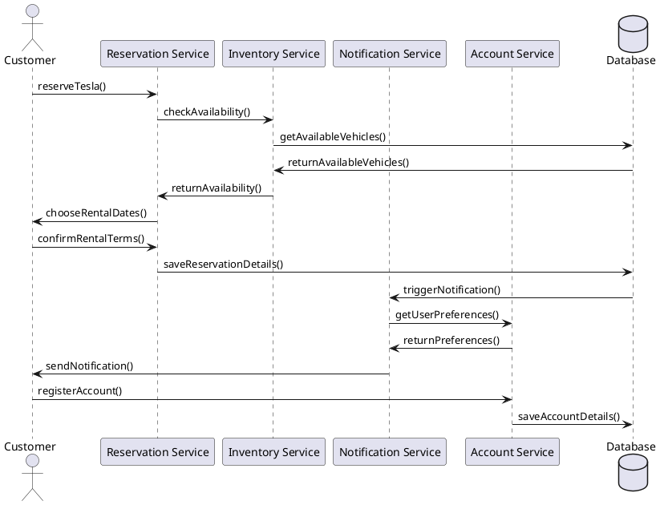

# cybertacotruck
stealth-mode app site used to validate business model for tracking tesla vehicles for fleet rental.  This will be developed as a mobile ready application but no specific mobile platform has been identified yet.

## Tech Stack
Proposed not all will be in initial phase
- Kubernetes
- Kafka
- React
- Go
- PostgreSQL
- 
## Services
Inital service should prompt the user for credentials and then use those credentials to obtain a token from Tesla.  This token will be used to access the [Tesla API](https://developer.tesla.com/docs/fleet-api).  The service will display the vehicle / cybertruck registered in the inventory service location stats.  The service will also provide a way to reserve a vehicle.  The service will also provide a way to cancel a reservation.

### Reservation
Used to interact with the customer and will be a small react based ui that will prompt the user for credentials that will be obtained via an on-boarding process that includes a registration link to a cell phone. A React based UI will be used to interact with the customer.

### Inventory
This service will be the reservation systems "bff" backend for a frontend. This service will interact with the Tesla Vehcile API.  Inventory events will be sent to and from the system using a kafka data pipeline.  A go long microservice will be used to process the inventory events.  The inventory service will provide a way to check the availability of a vehicle.  The inventory service will interact with the database to store and retrieve vehicle inventory.

### Notification
This service will interact with the inventory and account service.

### Account
Users that have been on-boarded will be able to use this service to manage their account.  This service will interact with the database to store and retrieve user preferences.

## Design

Proposed services overview

## Architecture
Use aws cloud  
### Development architecture

## References
[AWS EKS / Kubernetes](https://aws.amazon.com/eks/)
[React](https://react.dev/)
[Go Lang](https://go.dev/)
[Tesla API](https://developer.tesla.com/docs/fleet-api)

## Contributing
create a pull request and merge into main from a fork / branch