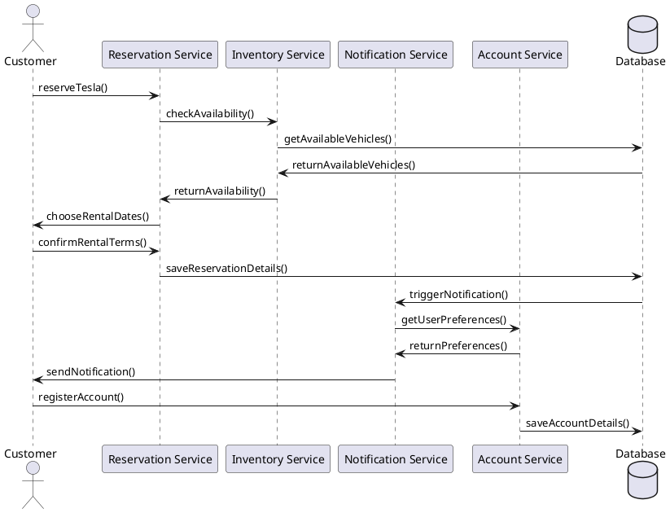

# cybertacotruck
cybertacotruck

## Design

```plantuml
@startuml
actor Customer
participant "Reservation Service" as Reservation
participant "Inventory Service" as Inventory
participant "Notification Service" as Notification
participant "Account Service" as Account

database "Database"

Customer -> Reservation : reserveTesla()
Reservation -> Inventory : checkAvailability()
Inventory -> Database : getAvailableVehicles()
Database -> Inventory : returnAvailableVehicles()
Inventory -> Reservation : returnAvailability()
Reservation -> Customer : chooseRentalDates()
Customer -> Reservation : confirmRentalTerms()
Reservation -> Database : saveReservationDetails()
Database -> Notification : triggerNotification()
Notification -> Account : getUserPreferences()
Account -> Notification : returnPreferences()
Notification -> Customer : sendNotification()
Customer -> Account : registerAccount()
Account -> Database : saveAccountDetails()
@enduml
```
